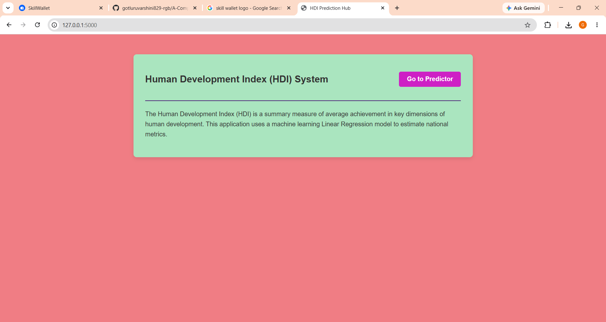
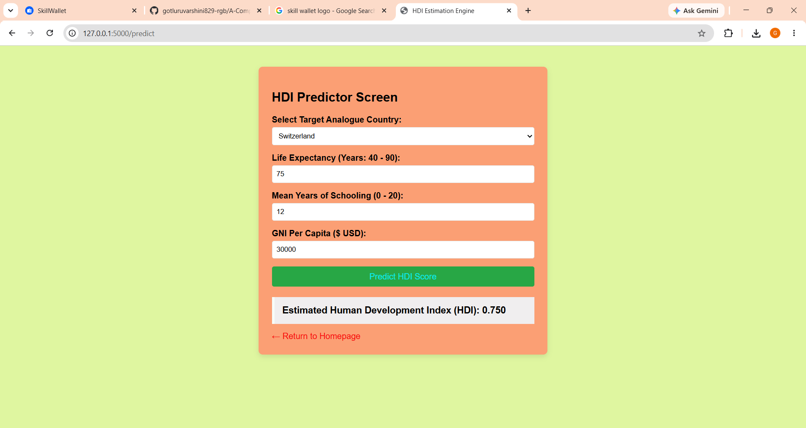

# A Comprehensive Measure of Well-Being

A Comprehensive Measure of Well-Being is a Machine Learning-based web application that predicts the Human Development Index (HDI) using key socio-economic indicators. The project evaluates the overall well-being of a country by analyzing three major dimensions of human development: health, education, and standard of living.

The system utilizes historical HDI data and applies data science and machine learning techniques to estimate HDI values based on attributes such as Life Expectancy at Birth, Expected Years of Schooling, Mean Years of Schooling, and Gross National Income (GNI) per Capita.

The project incorporates concepts including data collection, data preprocessing, exploratory data analysis (EDA), feature engineering, machine learning model training, model evaluation, predictive analytics, model serialization, and web application deployment. The trained model is integrated with a Flask-based web application that allows users to enter development indicators and obtain real-time HDI predictions.

### Key Concepts
- Human Development Index (HDI)
- Data Preprocessing
- Exploratory Data Analysis (EDA)
- Feature Selection
- Machine Learning Model Training
- Predictive Analytics
- Model Evaluation
- Data Visualization
- Flask Web Development
- Real-Time Prediction System

### Technologies Used
- Python
- Flask
- HTML
- CSS
- Pandas
- NumPy
- Scikit-learn
- Matplotlib
- Seaborn
- Joblib / Pickle
- GitHub
- Visual Studio Code

## Features
- Data Cleaning and Preprocessing
- Exploratory Data Analysis (EDA)
- Correlation Analysis
- Well-Being Prediction
- Data Visualization
- Machine Learning Model Evaluation

## Dataset Attributes
- Country
- HDI
- Life Expectancy
- Mean Years of Schooling
- Gross National Income
- Gender Development Index
- Other Well-Being Indicators

## Future Enhancements
- Deep Learning Models
- Interactive Dashboard
- Real-Time Data Integration
- Explainable AI Techniques
### Project Outcome
The system provides accurate HDI predictions and helps users understand the impact of health, education, and income indicators on overall human development and well-being.

###Prediction output

